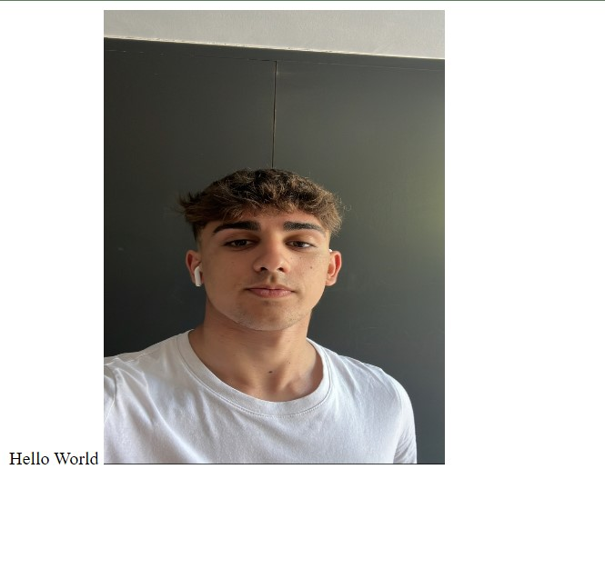

# Mi Projecto
> La introduccion de mi projecto es muy basica, lo unico especial que tiene este projecto esque es la primera pagina 
> que creo con un lenguaje HTML, el objetivo de la pagina es enseñar una foto tuya con un texto, la cosa mas complicada 
> ha sido hacer que se vea la fotografia nuestra.

> **Asi se veria mi web**

| Proceso                                                                                                                                               |
| ---------------------------------------------------------------------------------------------------------------------------------------------------- |
|1. Una vez tengamos el enlace de un directorio de github lo primero que haremos sera darle a crear un nuevo directorio.|
|2. Una vez en la creacion del directorio le daremos a importar un directorio. Y pondremos la direccion que tengamos lista para usar.|
|3. Por ultimo tendremos que esperar a que se nos acabe de instalar el directorio importado y le daremos a ir al clone.|
|4. por ultimo lo unico que nos queda es crear un codigo nuevo, para ello lo que haremos sera darle a crear codigo que esta en un boton verde en la pantalla principal del directorio, y desde ahi podemos empezar a crear codigos de diferentes tipos.|
